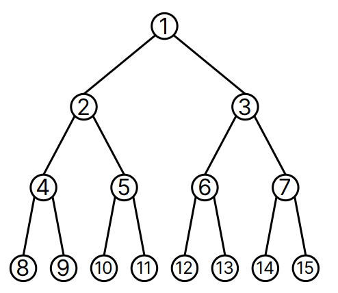
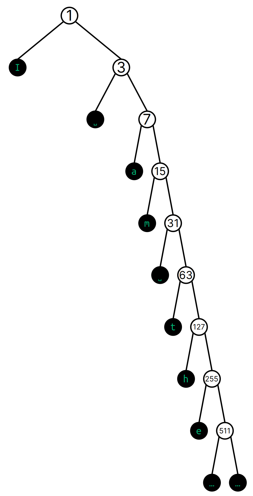
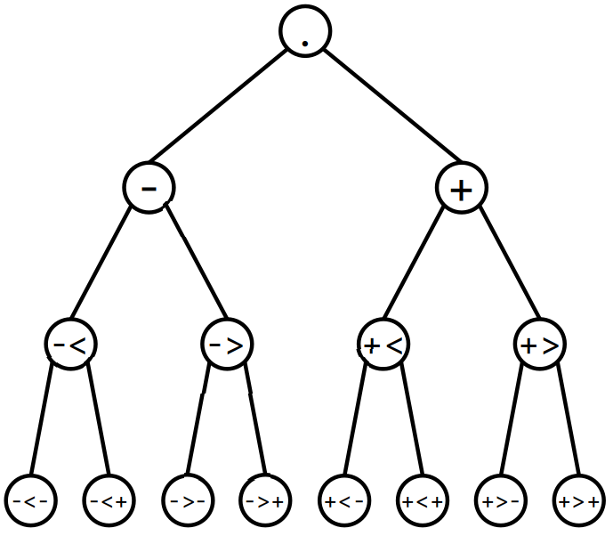

trees
lists
A list is actually a _mold builder_, a gate that produces a gate.  This is a common design pattern in Hoon.
tapes

##  Addressing Limbs

Everything in Urbit is a binary tree.  And all code in Urbit is also represented as data.  One corollary of these facts is that we can access any arbitrary part of an expression, gate, core, whatever, via addressing (assuming proper permissions, of course).  (In fact, we can even hot-swap parts of cores; this is beyond Hoon School Live but you'll eventually encounter it.)

There are three different ways to access values:

1. Numeric addressing is useful when you know the address, rather like knowing a room number directly.
2. Positional addressing is helpful when you don't want to figure out the room number, but you know how to navigate to the value.  This is like knowing the directions somewhere even if you don't know the room number.
3. Wing addressing is a way of attaching a name to the address so that you can access it directly.

### Numeric Addressing

Everything is an atom or a cell (pair).  By the same token, everything in Hoon (and in Urbit) can be represented as a binary tree.  This means a tree which only branches into two branches at each fork.

Typically, one would draw a tree branching _upwards_ from its trunk.  However, in computer science generally trees are drawn upside-down.


Each _node_ in the tree is either an atom or a cell.  Each node also has a unique numeric address:



- What is at address 1?
- What is at address 2?
- What is at address 3?

Since a node is _either_ an atom (value) _or_ a cell (fork), you never have to decide if the contents of a node is a direct value or a tree:  it just happens.

> ##  Tapes for Text
> 
> A `tape` is one way of representing a text message in Hoon.
> It is written with double quotes:
> 
> ```hoon
> "I am the very model of a modern Major-General"
> ```
>
> Recall that a `tape` is actually a list, a binary tree which 
> only branches rightwards and ends in a `~`:
> 
> 
> 
> What are the addresses of each letter in the tree for the Gilbert & Sullivan quote above?  Can you see a pattern?
{: .challenge}

#### Reference

- [“The Subject and its Legs”](https://urbit.org/docs/hoon/hoon-school/the-subject-and-its-legs)

### Positional Addressing

Much like relative directions, one can also state “left, left, right, left” or similar to locate a particular node in the tree.  These are written using `-` (left) and `+` (right) alternating with `<` (left) and `<` (right).



Lark notation can be very complicated and locate any position in a tree of any size.  However, it is most commonly used to grab the head or tail of a cell, e.g. in the type spear:

```hoon
-:!>('hello Mars')
```

Lark notation is not preferred in modern Hoon for more than one or two elements deep, but it can be helpful when working interactively with a complicated data structure like a JSON data object.

> ## Addressing the Fruit Tree
>
> Produce the numeric and lark-notated equivalent addresses for each of the following nodes in the binary fruit tree:
>
> 
>
> - 🍇
> - 🍌
> - 🍉
> - 🍏
> - 🍋
> - 🍑
> - 🍊
> - 🍍
> - 🍒
>
> > ### Solution
> >
> > - 🍇 `9` or `-<+`
> > - 🍌 `11` or `->+`
> > - 🍉 `12` or `+<-`
> > - 🍏 `16` or `-<-<`
> > - 🍋 `27` or `+<+>`
> > - 🍑 `42` or `->->-`
> > - 🍊 `62` or `+>+>-`
> > - 🍍 `87` or `->->+>`  # heuristic for these mathematically
> > - 🍒 `126` or `+>+>+<`
> {: .solution}
{: .challenge}

### Wings

One can also identify a resource by a label, called a wing.  A wing represents a depth-first search into the current subject (context).

A [_wing_](https://urbit.org/docs/hoon/reference/limbs/wing) is a resolution path pointing to a limb.  It's a search path, like an index to a particular labeled part of the subject.

E.g. to locate a value in a named tuple data structure:

```hoon
> =data [a=[aa=[aaa=[1 2] bbb=[3 4]] bb=[5 6]] b=[7 8]]
> -:aaa.aa.a.data
1
```

Notice that these read left-to-right!

> ## Limb Resolution Paths
>
> There are two symbols we use to search for a value:
>
> - `.`
> - `:`
>
> These are subtly different from each other and sometimes be
> used interchangeably.
>
> While [the docs on limbs](https://urbit.org/docs/hoon/reference/limbs/limb) contain a wealth of information on how limbs are resolved by the Hoon compiler, it is worth addressing in brief the two common resolution tools you will encounter today:  `.` dot and `:` col.
>
> - `.` dot resolves the wing path into the current subject.
> - `:` col resolves the wing path with the right-hand-side as the subject.
{: .callout}

> ## Shadowing Names (Optional)
>
> In any programming paradigm, good names are valuable and collisions are likely.  In Hoon, if you need to catch an outer-context label that has the same name as an inner-context value, use `^` ket to skip the depth-first match.
>
> ```
> ^^json
> ```
{: .callout}

---

Now we're equipped to go back and examine the syntax of the `%=` centis rune up above:  it _resolves a wing with changes_, which in this particular case means that it takes the `$` (default) arm of the trap core, applies certain changes, and re-evaluates the expression.

```hoon
|=  n=@ud
|-
~&  n
?:  =(n 1)
  n
%+  mul
n
$(n (dec n))
```

The `$()` syntax is the commonly-used irregular form of the [`%=` centis](https://urbit.org/docs/hoon/reference/rune/cen#centis) rune.

Now, we noted that `$` buc is the default arm for the trap.  It turns out that `$` is also the default arm for some other structures, like the gate!  That means we can cut out the trap, in the factorial example, and write something more compact like this:

```hoon
|=  n=@ud
?:  =(n 1)
  1
(mul n $(n (dec n)))
```

It's far more common to just use a trap, but you will see `$` buc used to manipulate a core in many in-depth code instances.

> ##  Expanding the Runes
> 
> `|=` bartis produces a gate.  It actually expands to
> 
> ```hoon
> =|  a=spec
> |%  ++  $  b=hoon
> --
> ``` 
> 
> where `=|` tisbar means to add the sample to the current subject.
> 
> Similarly, `|-` barhep produces a core with one arm `$`.
{: .callout}

https://urbit.org/docs/hoon/hoon-school/nouns#nouns-as-binary-trees
https://urbit.org/docs/hoon/hoon-school/lists

#### Example:  Number to Digits

- Compose a generator which accepts a number as `@ud` unsigned decimal and returns a list of its digits.

One verbose Hoon program 

```hoon
!:
|=  [n=@ud]
=/  values  *(list @ud)
|-  ^-  (list @ud)
?:  (lte n 0)  values
%=  $
  n       (div n 10)
  values  (weld ~[(mod n 10)] values)
==
```

Save this as a file `/gen/num2digit.hoon`, `|commit %base`, and run it:

```hoon
> +num2dig 1.000
~[1 0 0 0]

> +num2dig 123.456.789
~[1 2 3 4 5 6 7 8 9]
```

A more idiomatic solution would use the `^` ket infix to compose a cell and build the list from the head first.  (This saves a call to `++weld`.)

```hoon
!:
|=  [n=@ud]
=/  values  *(list @ud)
|-  ^-  (list @ud)
?:  (lte n 0)  values
%=  $
  n       (div n 10)
  values  (mod n 10)^values
==
```

A further tweak maps to `@t` ASCII characters instead of the digits.

```hoon
!:
|=  [n=@ud]
=/  values  *(list @t)
|-  ^-  (list @t)
?:  (lte n 0)  values
%=  $
  n       (div n 10)
  values  (@t (add 48 (mod n 10)))^values
==
```

(Notice that we apply `@t` as a mold gate rather than using the tic notation.  This is because `^` ket is a rare case where the order of evaluation of operators would cause the intuitive writing to fail.)

- Extend the above generator so that it accepts a cell of type and value (a `vase` as produced by the [`!>` zapgar](https://urbit.org/docs/hoon/reference/rune/zap#-zapgar) rune).  Use the type to determine which number base the digit string should be constructed from; e.g. `+num2dig !>(0xdead.beef)` should yield `~['d' 'e' 'a' 'd' 'b' 'e' 'e' 'f']`.
